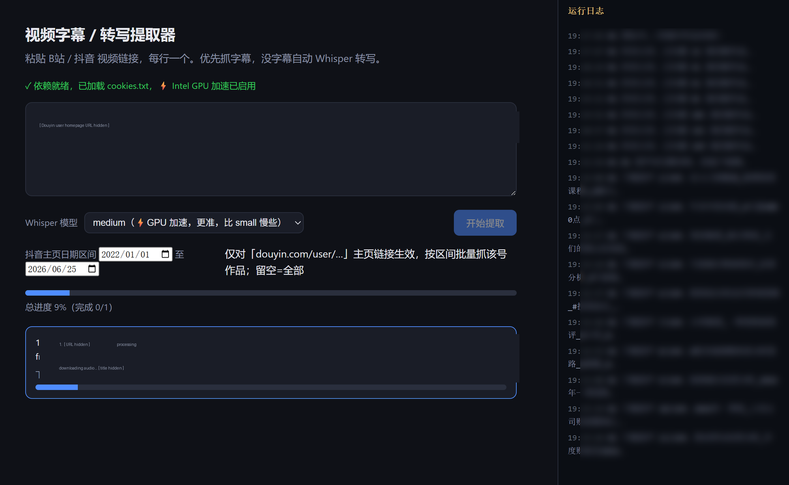

# 视频字幕 / 转写提取器



把 **B站 / 抖音** 视频链接 → 纯文字稿。优先抓字幕（快），没字幕自动用 Whisper 本机转写。
全程在本机跑，不上传视频，不消耗云端额度。

## 功能亮点

- **B站 / 抖音 → 纯文字稿**：字幕优先（秒出），没字幕走 Whisper 转写
- **⚡ Intel GPU 加速**：有 Intel 核显 / Arc 显卡时用 OpenVINO 跑 Whisper，实测比 CPU 快约 2.6×（核显），文字一字不差
- **三层引擎自动回落**：OpenVINO GPU → faster-whisper(CPU int8) → 旧 openai-whisper，哪个能用用哪个
- **📋 抖音用户主页批量**：输入主页链接 + 选日期区间，自动抓该号区间内全部作品、逐条转写、打包下载
- **省流量**：抖音批量只下「原声音频」(mp3) 不下高清视频，省约 70% 流量；遇到配 BGM 的作品自动回退下视频，不漏
- **Web UI**：实时进度条、右侧运行日志面板、处理中转圈动画、单条 / 打包下载

## 三步上手

```bash
# 1) 装系统级 ffmpeg（一次性，需要 sudo + 联网）
sudo apt update && sudo apt install -y ffmpeg

# 2) 装 Python 依赖（yt-dlp / whisper / fastapi / f2 等）
bash scripts/setup.sh

# 3) 启动网页应用
bash scripts/run.sh
# 浏览器打开 http://127.0.0.1:8000
```

页面里粘贴链接（每行一个）→ 选模型 → 开始提取 → 看进度 → 单条下载或「打包下载全部」。

## ⚡ 启用 Intel GPU 加速（可选，有 Intel 显卡强烈推荐）

没 GPU 也能用（走 CPU），但有 Intel 核显 / Arc 时开 GPU 加速能快好几倍。WSL2 也支持。

```bash
# 1) 装 Intel GPU 运行时，让 OpenVINO 能看到显卡
sudo apt install -y intel-opencl-icd libze-intel-gpu1 libze1
#    验证：python3 -c "import openvino as ov; print(ov.Core().available_devices)"  应含 'GPU'

# 2) 装 OpenVINO 推理库
pip install --user --break-system-packages openvino openvino-genai librosa

# 3) 下 OpenVINO 版 Whisper 模型到 .ovmodels/（HF_HUB_DISABLE_XET=1 防新后端挂起）
export HF_HUB_DISABLE_XET=1
python3 -c "from huggingface_hub import snapshot_download as d; \
d('OpenVINO/whisper-small-fp16-ov', local_dir='.ovmodels/whisper-small-fp16-ov')"
# 想要更准可把上面的 small 换成 medium 再下一份
```

启用后页面会显示「⚡ Intel GPU 加速已启用」，small / medium 即走 GPU。

## 抖音用户主页批量

粘贴用户主页链接（`douyin.com/user/<sec_uid>`，**别带 `modal_id`**，那是单条作品弹窗），
选「抖音主页日期区间」，开始提取即可批量抓该号区间内作品逐条转写。
- 只下原声音频，省流量、下载快；BGM 作品自动回退下视频
- CPU 转写慢，整号几百条不现实，所以默认按日期区间限范围

## 模型选择

| 模型 | 引擎 | 适用 |
|---|---|---|
| small | ⚡GPU | 默认，最快，口播够用 |
| medium | ⚡GPU | 要更高准确度时用，比 small 慢些 |
| large | CPU | 未提供 OV 版，走 CPU（慢），一般不用 |

没下对应尺寸的 OV 模型时会自动回退 CPU（faster-whisper）。

## 命令行版（不想开网页时）

```bash
# 单条测试
scripts/transcribe.sh "https://www.bilibili.com/video/xxxx"
# 批量：把链接逐行写进 urls.txt
scripts/transcribe.sh urls.txt
# 文字稿都在 transcripts/
```

## B站 / 抖音 登录态（WSL 注意）

WSL 里 `--cookies-from-browser chrome` 通常失败（Windows 侧 Chrome 的 cookie 是 DPAPI 加密，Linux 解不开）。
可靠做法：Chrome 装扩展「Get cookies.txt LOCALLY」，在 B站 / 抖音 登录后导出 `cookies.txt`，
放到项目根目录 `cookies.txt`，后端会自动加载。

## 性能提醒

- **有 Intel GPU 加速时**：8.7 分钟口播用 small 约 1.5 分钟（≈10× 实时）
- 没 GPU 走 CPU：40 分钟视频用 `medium` 大约十几到几十分钟，嫌慢选 `small`
- 抓到字幕的视频几乎秒出（不走转写）
- 后端默认同时最多跑 2 个任务；GPU 推理已串行化（单显卡并发无意义）

## 目录

```
app/
  server.py          后端（FastAPI）：批量任务、进度、运行日志、打包下载
  transcribe_core.py 提取核心：字幕优先 → GPU/CPU Whisper 三层回落；抖音批量
  static/            前端页面（进度条、运行日志面板）
scripts/
  setup.sh  run.sh   安装 / 启动
  transcribe.sh      命令行批量版
  srt2txt.py         字幕清洗
.ovmodels/           OpenVINO 版 Whisper 模型（GPU 用，按需下载，不入库）
transcripts/         输出的文字稿
```
